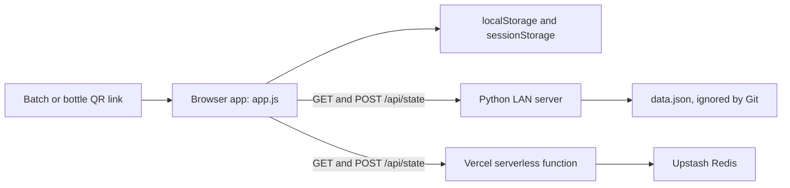

# Bharat Bee HoneyChain

Bharat Bee HoneyChain is a demonstration honey traceability application for Smart India Hackathon 2026 (SIH26021). It records a honey batch's reported journey from harvest through retail, links those records with SHA-256 hashes, and provides QR-based batch and bottle verification pages.

The project is designed as a working prototype. The browser app and its hash-linked ledger demonstrate traceability; they are not a decentralized blockchain, a production identity system, or independent proof that submitted supply-chain data is true.

## Contents

- [What it does](#what-it-does)
- [How the ledger works](#how-the-ledger-works)
- [Architecture and data storage](#architecture-and-data-storage)
- [Run locally](#run-locally)
- [Use the application](#use-the-application)
- [Deploy to Vercel](#deploy-to-vercel)
- [API reference](#api-reference)
- [Security and limitations](#security-and-limitations)
- [Project structure](#project-structure)
- [Troubleshooting](#troubleshooting)

## What it does

- **Tracks supply-chain stages.** Record harvest, lab testing, processing, dispatch, retail receipt, and bottle sales for each batch.
- **Builds a SHA-256 hash chain.** Every event is stored in a block containing its batch ID, sequence index, timestamp, role, action, event data, previous block hash, and its own hash.
- **Checks chain integrity.** The ledger view and public verification page recompute hashes and check links between successive blocks.
- **Creates QR verification links.** Batch QR codes open a public provenance page. A bottle identifier can also be included to show whether that bottle's token has been retired after sale.
- **Shows sample data.** Three seeded example batches are created on first run so the dashboard and verification flow can be explored immediately.
- **Supports local and hosted sharing.** Browser storage preserves local work; the included Python server shares state between devices on a local network; the Vercel API can share state across devices over the internet when connected to Upstash Redis.

## How the ledger works

Each batch has its own ordered chain. The first block points to a 64-character zero hash. Each later block points to the hash of the previous block. A block hash is computed from a JSON payload containing these fields in a fixed order:

```text
index, timestamp, role, action, batchId, data, previousHash
```

The browser uses the Web Crypto API when available and includes a JavaScript SHA-256 fallback for contexts where the Web Crypto API is unavailable. The Vercel function uses Node.js `crypto` to independently recompute incoming hashes before accepting ledger updates.

The app's normal batch workflow is:

1. **Register harvest** with beekeeper, hive, origin, honey type, harvest, and quantity details.
2. **Record lab testing** and the reported test values and result.
3. **Record processing** and bottling information.
4. **Record dispatch** and distribution details.
5. **Receive at retail**, then confirm sales. Sales retire the submitted bottle IDs; a batch is marked fully retired when its recorded retired-bottle count reaches its bottle count.

Every submitted workflow event appends a block and updates the batch's displayed status. The ledger page displays blocks and reports whether their hashes and links validate. A QR verification page shows available product and lab information, the provenance timeline, the chain integrity result, and the sale status for the requested bottle.

## Architecture and data storage



- **Browser app:** `index.html`, `app.js`, and `style.css`; no frontend build step is required. `qrcode.min.js` generates QR codes.
- **Browser persistence:** The ledger snapshot is stored under `hc_state` in `localStorage`. Login state is stored in `sessionStorage`. The optional custom QR target host is stored under `hc_custom_host` in `localStorage`.
- **Local shared state:** `local/server.py` serves the project and exposes `/api/state`. It reads and writes `data.json` in the project root. This lets devices on the same network share batches when they can reach the host computer.
- **Hosted shared state:** `api/state.js` exposes the same state endpoint as a Vercel serverless function and stores the snapshot in Upstash Redis. Without the function and configured Redis, static hosting still serves the browser app, but new data is not shared between visitors.
- **QR base URL:** `CFG.PUBLIC_URL` in `app.js` can pin QR links to the deployed site. When it is empty, the app derives the target from the current address, with a local-network host option for local testing.

## Run locally

### Requirements

- Python 3 available as `python` on Windows, or `python3` on macOS/Linux.
- A modern browser. Google Fonts are loaded from Google Fonts when the app has network access; the rest of the frontend assets are in this repository.

### Windows

Double-click `start.bat`. It starts the local server on port `8000` and prints the local URL and, when detected, the computer's LAN address.

### macOS or Linux

From the repository root, run:

```bash
python3 local/server.py
```

To use a different port, pass it as the first argument:

```bash
python3 local/server.py 8080
```

Open `http://localhost:8000` (or the port you selected). To test scanning from a phone on the same Wi-Fi network, open the QR Codes view on the host computer, enter the computer's LAN address and port under **Mobile QR Target Host Address**, and select **Set Host**. The phone must be able to reach that address; the host firewall may need to allow the selected port.

The local server writes shared data to `data.json`. That file and its temporary write file are excluded by `.gitignore`; local batch data is not committed to the repository.

## Use the application

1. Open the app and choose the admin login. The prototype displays the demo credentials on the login screen: username `admin`, password `honeychain2026`.
2. Open the dashboard and select a seeded batch or register a new harvest.
3. Complete each supply-chain workflow stage in order. The form can be submitted with entered data or populated with the demo autofill helper where available.
4. Visit **Blockchain** to filter batch records and inspect the hash integrity result.
5. Visit **QR Codes** to display a batch QR or simulate a scan. For a real phone, configure a reachable LAN address when running locally, or use the public deployment URL when hosted.
6. At retail, record receipt and confirm bottle sales. A verification link includes the batch ID and may include a bottle ID, for example `?verify=BATCH-2024-HRV-001&bottle=B001`.

## Deploy to Vercel

The frontend is static and does not require a build command. For cross-device hosted data sharing, deploy the included `/api/state` serverless function and connect an Upstash Redis database.

1. Import this GitHub repository into Vercel. Use the **Other** framework preset and leave the build command and output directory empty.
2. In Vercel Storage, create/connect an Upstash Redis database to the project. The function reads `KV_REST_API_URL` and `KV_REST_API_TOKEN`; it also accepts `UPSTASH_REDIS_REST_URL` and `UPSTASH_REDIS_REST_TOKEN`.
3. Redeploy after connecting storage so the serverless function receives its environment variables.
4. Set `CFG.PUBLIC_URL` in `app.js` to the public deployment URL, such as `https://your-project.vercel.app`, then commit and push the change. QR links will use this address.
5. If deployment protection is enabled, configure it so intended public QR visitors can access the site without a Vercel sign-in wall.
6. Check `https://your-project.vercel.app/api/state`. With storage configured it should return JSON containing `chains` and `batches`. If it reports that storage is not configured, verify the Upstash connection and redeploy.

See [DEPLOY.md](DEPLOY.md) for the original deployment notes and the optional ledger reset configuration.

## API reference

The Vercel serverless function in `api/state.js` handles `/api/state`:

| Method   | Behavior                                                                                                                                       |
| -------- | ---------------------------------------------------------------------------------------------------------------------------------------------- |
| `GET`    | Returns the shared `{ "chains": {}, "batches": {} }` snapshot, or the stored snapshot.                                                         |
| `POST`   | Validates and merges a snapshot. Valid updates may extend existing chains but cannot replace or shorten a stored chain.                        |
| `DELETE` | Deletes the shared snapshot only when the optional `RESET_KEY` environment variable is set and the matching `key` query parameter is supplied. |

The serverless function checks block indexes, batch IDs, previous hashes, and recomputed SHA-256 hashes. It rejects markup characters, limits the request body to 400 KB, and accepts chains up to 60 blocks. `local/server.py` provides `GET` and `POST` for local sharing; it does not implement the Vercel function's validation or `DELETE` behavior.

## Security and limitations

- **Demo login only:** `admin / honeychain2026` is embedded in client-side JavaScript. It is visible to visitors and does not protect data or administrative actions. Do not use it for real accounts or sensitive deployments.
- **Hashing is not authorship verification:** A hash chain can reveal accidental or unsophisticated edits when the stored chain is trusted, but this app does not sign events with verified identities. The browser's client can be modified, and the public API does not authenticate who submitted an update.
- **Not a decentralized blockchain:** The ledger is an application data structure stored in browser storage, a local JSON file, or Redis. There is no consensus network, independent validator set, wallet, or on-chain transaction.
- **Reported data is not independently certified:** Beekeeper, lab, processing, and retail details are submitted through the app. The prototype does not connect to real IoT sensors or validate laboratory certificates with an external authority.
- **Local server is for demos:** It binds to all network interfaces and its POST endpoint writes supplied state without the serverless function's validation. Use it only on a trusted network.
- **Public data:** QR verification is intended for public viewing. Do not enter personal, confidential, or production-sensitive information.
- **License:** This repository does not currently include a `LICENSE` file. Ask the project owners for permission before redistributing or reusing the code.

## Project structure

```text
.
|-- api/
|   `-- state.js          Vercel shared-ledger API
|-- local/
|   `-- server.py         Local web server and LAN state API
|-- app.js                Frontend application, workflows, hashing, and verification
|-- index.html            Application entry point
|-- style.css             Application styles
|-- qrcode.min.js         QR code generation library
|-- start.bat             Windows local-start helper
|-- DEPLOY.md             Deployment notes
`-- README.md             Project guide
```

## Troubleshooting

- **A phone cannot open a local QR:** Confirm both devices are on the same Wi-Fi, set the QR target to the host's reachable LAN IP and port, and check the host firewall.
- **The hosted app loads but devices do not share new batches:** Confirm the Vercel project has a connected Upstash database and the required environment variables, then redeploy.
- **The API reports `Storage not configured`:** Connect Upstash and redeploy the Vercel project.
- **A batch does not appear on another device:** Static-only hosting has no shared persistence. Use the local server on a reachable network or configure the Vercel API and Redis.
- **The app shows stale local data:** It merges saved browser state with remote state, preferring the longer chain for a batch. For demo resets, clear the site's browser storage. On Vercel, the shared ledger can be reset only when `RESET_KEY` is configured and the protected `DELETE /api/state?key=...` request is authorized.
