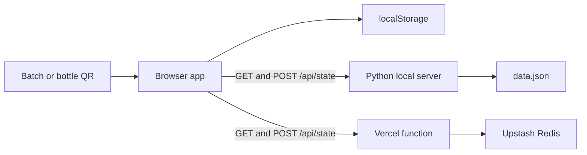

# Bharat Bee HoneyChain

Bharat Bee HoneyChain is a Smart India Hackathon 2026 (SIH26021) prototype for recording and viewing the reported journey of a honey batch, from harvest through retail. It combines a browser-based workflow, SHA-256 hash-linked event records, and QR pages for batch and bottle verification.

This is a traceability demonstration, not a decentralized blockchain or a production identity system. Hashes can help reveal changes to a stored event chain, but they do not prove that a submitted harvest, laboratory result, or sale is true.

## Features

- Record batch events for harvest, lab testing, processing, dispatch, retail receipt, and bottle sales.
- Give each event a timestamp, stage/action, batch ID, event data, previous-block hash, and SHA-256 hash.
- Inspect the ledger and verify each block's hash and its link to the previous block.
- Create QR codes for batch provenance and bottle-level sale status.
- Explore the dashboard with seeded demonstration batches.
- Save browser data locally, share it across a local network with the included Python server, or share hosted data through the Vercel API and Upstash Redis.

## How the Ledger Works

Each batch has an ordered chain of event blocks. The first block points to a genesis value consisting of 64 zeroes. Each later block includes the prior block's hash. The hash is calculated over a JSON object with the fields below in this order:

```text
index, timestamp, role, action, batchId, data, previousHash
```

The browser uses the Web Crypto API when available and includes a SHA-256 fallback. The Vercel function independently recalculates hashes when it receives updates. It accepts valid new chains and extensions to stored chains; it does not allow a submitted update to shorten or rewrite an existing chain.

The typical batch flow is:

1. Register the harvest and its origin, beekeeper, honey type, and quantity.
2. Add reported laboratory test information.
3. Record processing and bottling details.
4. Record dispatch and distribution details.
5. Record retail receipt and confirm bottle sales. Sold bottle IDs are marked retired in the traceability record.

The verification view shows the recorded provenance, available batch details, chain-integrity result, and bottle status when a bottle ID is included in the QR URL.

## Architecture and Storage



- **Frontend:** `index.html`, `app.js`, and `style.css`; there is no frontend build step. `qrcode.min.js` generates QR codes.
- **Browser storage:** The ledger snapshot is saved as `hc_state` in `localStorage`. Login state uses `sessionStorage`; an optional custom QR host uses `hc_custom_host` in `localStorage`.
- **Local sharing:** `local/server.py` serves the app and exposes `/api/state`. It stores shared state in `data.json` at the project root. Runtime state files are ignored by Git.
- **Hosted sharing:** `api/state.js` implements `/api/state` as a Vercel serverless function and persists state in Upstash Redis. It reads `KV_REST_API_URL` and `KV_REST_API_TOKEN`, with `UPSTASH_REDIS_REST_URL` and `UPSTASH_REDIS_REST_TOKEN` as alternatives.
- **QR address:** `CFG.PUBLIC_URL` in `app.js` can be set to a fixed public base URL. If unset, the app derives the URL from its current address; local phone testing can use a reachable LAN address configured in the QR Codes view.

## Run Locally

### Requirements

- Python 3 available as `python` on Windows or `python3` on macOS/Linux.
- A modern web browser.

No npm install or frontend compilation is required.

### Windows

Double-click `start.bat`. It starts the server on port `8000` and prints the local address and, when detected, a LAN address.

### macOS or Linux

From the project root, run:

```bash
python3 local/server.py
```

To choose another port, pass it as the first argument:

```bash
python3 local/server.py 8080
```

Open `http://localhost:8000`, or substitute the port you selected. To scan a QR code from a phone on the same Wi-Fi, configure the QR target host in the app with the computer's reachable LAN IP and port. The phone must be able to reach the host, and its firewall may need to allow that port.

The local server writes shared data to `data.json` and uses `data.json.tmp` while replacing the file. These files are excluded from Git, so demo records are not committed.

## Use the Application

1. Open the app and sign in with the demonstration account shown on the login screen: username `admin`, password `honeychain2026`.
2. Explore a seeded batch on the dashboard or begin a new batch by recording a harvest.
3. Advance the batch through the workflow and submit the reported information for each stage.
4. Open **Blockchain** to inspect a batch's event blocks and integrity status.
5. Open **QR Codes** to generate or preview batch and bottle verification links.
6. At retail, record receipt and confirm sold bottle IDs to update their retirement status.

A verification URL can include both identifiers, for example:

```text
https://your-host/?verify=BATCH-2024-HRV-001&bottle=B001
```

## Deploy to Vercel

The frontend is static; the optional `/api/state` function provides hosted shared storage. For shared records across devices, connect Upstash Redis to the Vercel project.

1. Import this repository into Vercel. Select the **Other** framework preset and leave the build command and output directory empty.
2. Create or connect an Upstash Redis database from the Vercel project. Confirm the Redis REST URL and token environment variables are available to the function.
3. Redeploy after connecting storage so the function receives the environment variables.
4. Set `CFG.PUBLIC_URL` in `app.js` to the public deployment URL (for example, `https://your-project.vercel.app`) and push the change so QR codes use the public address.
5. Configure deployment protection so intended public QR visitors can open the site without signing in to Vercel.
6. Visit `https://your-project.vercel.app/api/state`. With storage configured, it should return JSON containing `chains` and `batches`.

See [DEPLOY.md](DEPLOY.md) for additional deployment notes.

## API Reference

The Vercel function in `api/state.js` handles `/api/state`:

| Method   | Behavior                                                                                                           |
| -------- | ------------------------------------------------------------------------------------------------------------------ |
| `GET`    | Returns the shared `{ "chains": {}, "batches": {} }` snapshot, or the saved snapshot.                              |
| `POST`   | Validates an incoming snapshot and merges valid new chains or extensions.                                          |
| `DELETE` | Clears the shared snapshot only when `RESET_KEY` is configured and the matching `key` query parameter is supplied. |

The hosted function validates batch IDs, block indexes, previous-hash links, and recalculated SHA-256 hashes. It rejects markup characters, limits request bodies to 400 KB, and accepts chains of at most 60 blocks. The local Python server supports `GET` and `POST` for demos but does not implement the same validation or protected `DELETE` behavior.

## Security and Limitations

- **Demo login only:** `admin / honeychain2026` is embedded in client-side JavaScript. It is visible to visitors and can be bypassed; it does not protect administrative actions or data.
- **No authenticated authorship:** The hash chain detects inconsistencies relative to a trusted stored chain, but events are not signed by verified identities. The hosted API does not authenticate submitters.
- **Not a decentralized blockchain:** Data is stored in browser storage, a local JSON file, or Redis. There is no consensus network, independent validator set, wallet, or on-chain transaction.
- **Submitted information is not independently certified:** The prototype does not validate real laboratory certificates or connect to physical IoT sensors.
- **Local server is for trusted demos:** It listens on all network interfaces and accepts state updates without the hosted API's validation. Do not expose it to an untrusted network.
- **Avoid sensitive data:** QR verification is intended to be public. Do not enter personal, confidential, or production-sensitive information.
- **License:** This repository does not currently include a `LICENSE` file. Ask the project owners for permission before redistributing or reusing the code.

## Project Structure

```text
.
|-- api/
|   `-- state.js          Vercel shared-ledger API
|-- local/
|   `-- server.py         Local web server and LAN state API
|-- app.js                Frontend workflows, hashing, and verification
|-- index.html            Application entry point
|-- style.css             Application styles
|-- qrcode.min.js         QR-code generation library
|-- start.bat             Windows local-start helper
|-- DEPLOY.md             Deployment notes
`-- README.md             Project guide
```

## Troubleshooting

- **A phone cannot open a local QR:** Confirm both devices are on the same Wi-Fi, use the host computer's reachable LAN address and selected port, and check the host firewall.
- **Devices do not share hosted records:** Connect Upstash Redis to the Vercel project, verify the REST URL/token environment variables, then redeploy.
- **The API says storage is not configured:** Check the Redis connection and redeploy the latest deployment.
- **A batch appears on only one device:** Static-only hosting does not provide shared persistence. Use the local server on a reachable network or configure the Vercel function and Redis.
- **Local data looks stale:** Browser data is persisted per browser. Clear the site's storage to reset the local demo. For hosted data, `DELETE /api/state` requires `RESET_KEY` to be set in Vercel and supplied as the `key` parameter.
